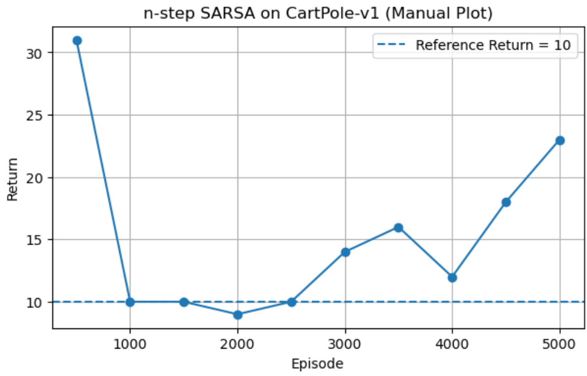

## **CartPole-v1 Using n-Step SARSA**

The implementation uses:

* On-policy n-step SARSA updates
* Neural network function approximation for Q-values
* Experience replay buffering for stable training
* ε-greedy exploration strategy

## **Methodology**

### **Algorithm**

The agent updates its action-value function using the n-step return:

[
G_t = \sum_{k=1}^{n} \gamma^{k-1} R_{t+k} + \gamma^n Q(S_{t+n}, A_{t+n})
]

Key characteristics:

* On-policy learning
* Bootstrapped multi-step returns
* Function approximation via a feedforward neural network

---

## **Implementation Components**

* Environment interaction loop
* Experience replay buffer (fixed capacity)
* Neural network Q-function approximator
* ε-greedy action selection
* Gradient-based optimization with clipping

---

## **Results**

### **Training Performance**

